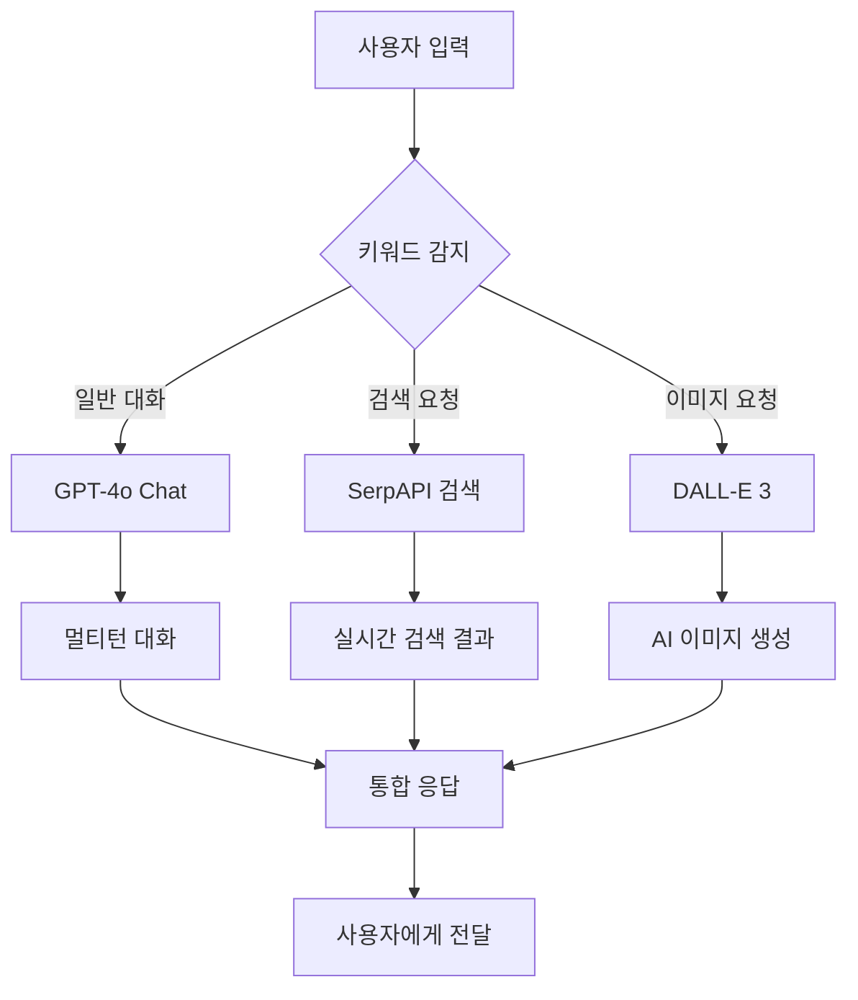

# 🤖 AI ChatBot UI with Advanced Features

**차세대 AI 챗봇 인터페이스** - GPT-4o, 웹 검색, 이미지 생성이 통합된 올인원 AI 어시스턴트

   

## ✨ 주요 기능

### 🧠 **GPT-4o 기반 대화**
- **멀티턴 대화**: 대화 히스토리를 기억하는 자연스러운 대화
- **한국어 완벽 지원**: 한국어와 영어 모두 자연스럽게 처리
- **컨텍스트 인식**: 이전 대화 맥락을 이해하고 연관성 있는 응답

### 🔍 **실시간 웹 검색**
- **Google 검색 연동**: SerpAPI를 통한 실시간 최신 정보 검색
- **스마트 검색**: 🌍 버튼으로 검색 모드 토글
- **출처 표기**: 검색 결과에 URL과 시간 자동 표기
- **Function Calling**: OpenAI Function Calling으로 자동 검색 판단

### 🎨 **AI 이미지 생성**
- **DALL-E 3 연동**: "그려줘" 키워드로 고품질 이미지 생성
- **대화 맥락 반영**: 이전 대화 내용을 고려한 맥락적 이미지 생성
- **한국어 최적화**: 한국어 프롬프트를 영어로 번역 후 최적화
- **이중 보안 시스템**: Function Calling + 직접 키워드 감지

### 🚀 **고급 기술 스택**
- **Next.js 14**: 최신 React 프레임워크
- **OpenAI Chat Completions API**: 안정적인 GPT-4o 연동
- **클라이언트 사이드 API**: GitHub Pages에서 완벽 작동
- **TypeScript**: 타입 안전성 보장

## 🎯 사용 예시

### 💬 **일반 대화**
```
사용자: "안녕하세요! 오늘 날씨가 어때요?"
AI: "안녕하세요! 현재 날씨 정보를 검색해드릴게요."
🌍 → 실시간 날씨 검색 → 최신 정보 제공
```

### 🔍 **웹 검색**
```
사용자: 🌍 + "2024년 AI 트렌드"
AI: → Google 검색 → 최신 AI 트렌드 정보 + 출처 링크
```

### 🎨 **이미지 생성**
```
사용자1: "파란 하늘이 예쁘네요"
사용자2: "고양이 그려줘"
AI: → 대화 맥락 분석 → "파란 하늘 배경의 고양이" 이미지 생성
```

## 🛠️ 기술 아키텍처



### 🔧 **핵심 컴포넌트**
- **Frontend**: Next.js 14 + TypeScript + Tailwind CSS
- **API**: 클라이언트 사이드 OpenAI API 직접 호출
- **AI Engine**: OpenAI GPT-4o + DALL-E 3
- **Search**: SerpAPI (Google Search)
- **Deployment**: GitHub Pages (정적 사이트)

## 🚀 빠른 시작

### 1. 저장소 클론
```bash
git clone https://github.com/muniv/chatgpt_clone.git
cd chatgpt_clone
```

### 2. 의존성 설치
```bash
npm install
```

### 3. 개발 서버 실행
```bash
npm run dev
```

브라우저에서 `http://localhost:3000`으로 접속하세요!

## 🔑 API 키 설정

### 🤖 **OpenAI API 키** (필수)
1. [OpenAI Platform](https://platform.openai.com/)에 가입
2. API Keys 섹션에서 새 키 생성
3. GPT-4o와 DALL-E 3 사용 권한 확인
4. 애플리케이션에서 API 키 입력

### 🔍 **SerpAPI 키** (웹 검색용, 선택사항)
1. [SerpAPI](https://serpapi.com/)에 가입
2. 대시보드에서 API 키 확인
3. 월 100회 무료 검색 제공

## 🌐 GitHub Pages 배포

### 자동 배포
1. **GitHub에 푸시**
   ```bash
   git add .
   git commit -m "Update for GitHub Pages"
   git push origin main
   ```

2. **GitHub Actions 자동 배포**
   - GitHub Actions가 자동으로 빌드 및 배포
   - `gh-pages` 브랜치에 정적 파일 생성
   - GitHub Pages에서 자동으로 호스팅

3. **배포 확인**
   - GitHub 저장소 Settings → Pages에서 배포 상태 확인
   - `https://[username].github.io/chatgpt_clone`에서 접속

### 수동 배포
```bash
npm run build:static
npm run deploy
```

## 📱 사용법

### 기본 사용법
1. **OpenAI API 키 입력**: 첫 접속 시 API 키 입력
2. **일반 대화**: 자유롭게 질문하고 대화하기
3. **웹 검색**: 🌍 버튼 클릭 후 검색하고 싶은 내용 입력
4. **이미지 생성**: "그려줘", "그림", "이미지" 등 키워드 사용

### 고급 기능
- **대화 맥락**: 이전 대화를 기억하는 연속적 대화
- **맥락적 이미지**: 대화 내용을 반영한 이미지 생성
- **실시간 정보**: 최신 뉴스, 날씨, 주가 등 실시간 검색

## 🎨 이미지 생성 키워드

다음 키워드들로 이미지 생성이 가능합니다:
- **한국어**: "그려줘", "그려", "그림", "이미지", "만들어줘", "그려봐"
- **영어**: "draw", "create", "image", "generate"

### 이미지 생성 예시
```
"귀여운 강아지 그려줘" → 🎨 귀여운 강아지 이미지
"파리의 에펠탑 그림 만들어줘" → 🎨 에펠탑 이미지
"추상적인 예술 작품 그려봐" → 🎨 추상 예술 이미지
```

## 🔧 개발자 가이드

### 프로젝트 구조
```
chatgpt_clone/
├── app/
│   ├── [locale]/
│   │   ├── page.tsx           # 메인 페이지 (API 키 입력)
│   │   └── chat/page.tsx      # 채팅 인터페이스
│   └── globals.css
├── components/               # React 컴포넌트
├── lib/
│   └── client-api.ts        # 클라이언트 사이드 API
├── types/                   # TypeScript 타입 정의
└── public/                  # 정적 파일
```

### 주요 특징
- **클라이언트 사이드 API**: 서버 없이 브라우저에서 직접 OpenAI API 호출
- **정적 사이트**: GitHub Pages에서 완벽 작동
- **타입 안전성**: TypeScript로 전체 코드베이스 작성
- **반응형 디자인**: 모바일과 데스크톱 모두 지원

## 🤝 기여하기

1. Fork the Project
2. Create your Feature Branch (`git checkout -b feature/AmazingFeature`)
3. Commit your Changes (`git commit -m 'Add some AmazingFeature'`)
4. Push to the Branch (`git push origin feature/AmazingFeature`)
5. Open a Pull Request

## 📄 라이선스

This project is licensed under the MIT License - see the <LICENSE> file for details.

## 🙏 감사의 말

* OpenAI - GPT-4o 및 DALL-E 3 API
* GitHub - Pages 호스팅
* SerpAPI - 검색 API
* Next.js - React 프레임워크

## 📞 문의 및 지원

* **이슈 리포트**: GitHub Issues
* **기능 요청**: GitHub Discussions
* **버그 신고**: 상세한 재현 단계와 함께 이슈 등록

---

**⭐ 이 프로젝트가 유용하다면 Star를 눌러주세요!**

_Made with ❤️ by AI Enthusiasts_
